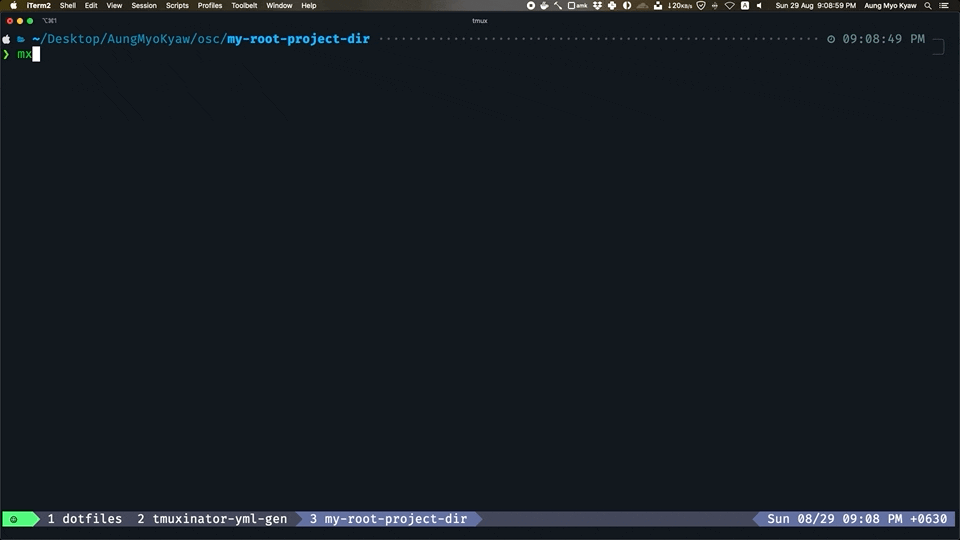

# tmuxinator-yml-gen

> tmuxinator yaml file generator

## Use Case

- imagine your work need to check on 10+ project and switching across project
- tired of creating tmuxinator yaml for 10+ project folder
- here is my way of creating tmuxinator yaml
- may be u are using better solution</br>
- i hope it may help u ❄️



## Install

```shell
npm install -g tmuxinator-yml-gen
```

## Usage

_switch to project list root folder_

```
.
├── project-1
├── project-10
├── project-2
├── project-3
├── project-4
├── project-5
├── project-6
├── project-7
├── project-8
└── project-9
```

```shell
Usage
  $ mx-yml-gen
Options
  --name
  --editor
  --cp [copy to config]
Examples
  $ mx-yml-gen --name=amk --editor=vim --cp=true
```

_generated yaml file will be place on current dir of `tmuxinator-yml-gen` folder_

_u may need to copy yaml file to `~/.tmuxinator` folder or use --cp=true option_

## License

MIT © [Aung Myo Kyaw](https://github.com/AungMyoKyaw)
